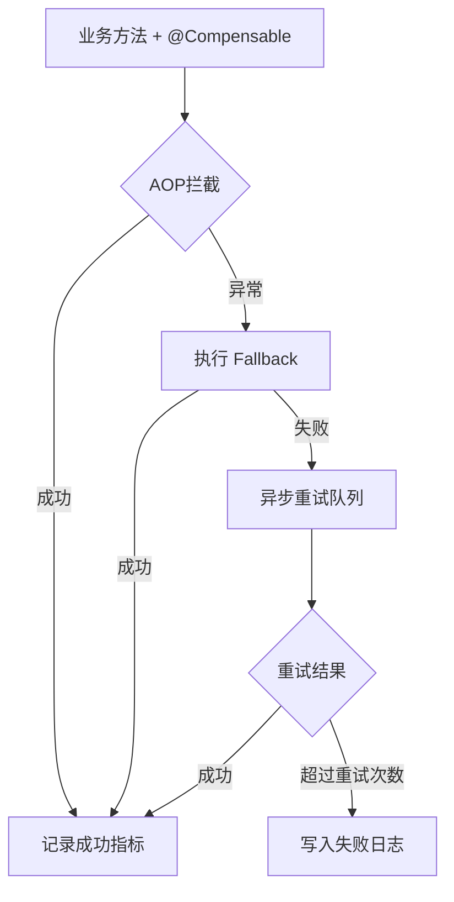

# CompensateX

[](https://github.com/xiaofengche123/CompensateX/actions/workflows/ci.yml)
[](https://adoptium.net/)
[](LICENSE)

CompensateX 是一个通用 RPC 补偿组件示例工程，基于 **Spring Boot 2.7.18** + **Dubbo 泛化调用**，提供以下能力：

- `@Compensable` 注解驱动补偿流程
- 异步重试（线程池：核心 2、最大 5、队列 100）
- 幂等控制（Redis 分布式幂等，支持 SpEL，如 `#p0.userId`）
- 监控指标采集（成功/失败/重试）
- 最终失败写入 `failed_compensations.log`

## 项目结构

- `com.compensatex.annotation`：补偿注解定义
- `com.compensatex.aop`：AOP 拦截器
- `com.compensatex.core`：补偿管理与上下文
- `com.compensatex.executor`：异步重试执行器
- `com.compensatex.idempotent`：幂等检查器
- `com.compensatex.monitor`：指标采集器
- `com.compensatex.dubbo`：Dubbo 泛化调用器
- `com.compensatex.demo`：演示服务与启动类
- `com.compensatex.autoconfig`：Starter 自动配置

## 核心设计

### 1. 整体流程

```
业务方法 + @Compensable
        ↓
   执行成功？ ────Yes───→ 记录成功指标 → 结束
        ↓ No
   立即执行 Fallback
   （本地方法 / 远程 Dubbo 服务）
        ↓
   Fallback 成功？ ────Yes───→ 记录成功 → 结束
        ↓ No
   进入异步重试队列
   （线程池：核心2/最大5/队列100）
        ↓
   重试达到上限？ ────Yes───→ 写入 failed_compensations.log → 结束
        ↓ No
   按配置延迟后再次执行 Fallback
   （循环）
```

### 2. 幂等控制（核心难点）

- **方案**：基于 Redis + SpEL 表达式
- **流程**：
  1. 从注解的 `idempotentKey` 中解析 SpEL（如 `#p0.userId`）
  2. 生成幂等键：`compensate:idempotent:{className}:{methodName}:{keyValue}`
  3. 执行 `SETNX`，成功则继续，失败则直接返回（重复请求）
  4. Redis 不可用时自动降级到 `ConcurrentHashMap` 内存模式
- **为什么这样设计**：SpEL 让调用方可灵活指定业务唯一标识（订单号、用户ID等），比固定 key 更通用

### 3. 重试与失败处理

| 阶段 | 行为 |
|------|------|
| 第1次失败 | 立即执行 Fallback（最快响应） |
| Fallback 失败 | 提交到异步线程池，延迟 `retryDelay` 后重试 |
| 重试达到 `retryTimes` | 写入 `failed_compensations.log`，不再重试 |
| 服务重启 | 内存队列中的任务会丢失（生产改进：持久化到 DB） |

### 4. Dubbo 泛化调用

- 不依赖服务提供方的 API Jar 包，通过 `GenericService` 动态调用
- 调用参数：`interfaceName`、`methodName`、`parameterTypes`、`args`
- 适用场景：通用补偿组件、网关、测试平台

### 5. 监控指标

| 指标 | 获取方式 |
|------|---------|
| 补偿成功次数 | `CompensateMonitor.getSuccessCount()` |
| 补偿失败次数 | `CompensateMonitor.getFailureCount()` |
| 当前重试队列大小 | `CompensateMonitor.getQueueSize()` |
| 最终失败落日志数 | 读取 `failed_compensations.log` 行数 |

（可扩展暴露为 Spring Boot Actuator 端点）

## 架构图（Mermaid）



## 快速启动

```bash
./mvnw clean package
./mvnw spring-boot:run -Dspring-boot.run.main-class=com.compensatex.demo.DemoClient
```

或者直接运行：

```bash
./mvnw exec:java -Dexec.mainClass=ManualTest
```

## 使用示例

```java
@Compensable(
    retryTimes = 3,
    retryDelay = 1500L,
    fallbackMethod = "localFallback",
    remoteFallback = "com.foo.RemoteService",
    idempotentKey = "#p0.userId"
)
public String createOrder(Request req) {
    // 业务逻辑
}
```

## 行为说明

1. 业务方法执行成功：记录成功指标。
2. 业务方法执行失败：立即尝试本地/远程 fallback。
3. fallback 失败：进入异步重试，按照 `retryTimes + retryDelay` 执行。
4. 所有重试失败：写入 `failed_compensations.log`。

## 注意事项

- 默认启用 Redis 幂等；当 Redis 不可用时会自动降级到内存模式。
- Dubbo 泛化调用依赖运行时 Dubbo 配置（注册中心、协议等）。
- `application.properties` 已提供最简示例配置。

## 自动化测试

```bash
./mvnw test
```

当前最小测试集覆盖：

- Redis 不可用时的内存幂等降级与重复拦截
- 成功、失败、重试指标的累计快照
- 补偿上下文参数的防御性复制与注解配置保留

GitHub Actions 使用 JDK 8 执行 Maven 测试。

## 已知限制与改进方向

### 当前版本局限

1. **任务易失**  
   补偿任务仅在内存队列中等待重试，应用重启后未完成的任务会丢失。

2. **缺少分布式协调**  
   多实例部署时，没有分布式锁保护，同一任务可能被多个节点重复补偿。

3. **Dubbo 调用未设超时**  
   `DubboGenericInvoker` 未配置超时时间，下游服务响应慢时可能导致线程堆积。

4. **线程池参数硬编码**  
   核心线程数、最大线程数、队列容量写死在代码中，无法通过配置文件调整。

5. **无管理端点**  
   监控指标未暴露为 HTTP 端点（如 `/actuator/compensate/metrics`），运维侧难以观察。

### 后续优化计划

| 改进项 | 方案 | 优先级 |
|--------|------|--------|
| 任务持久化 | 增加 `compensation_task` 表 + 定时扫描 Job | P0 |
| 分布式锁 | Redis `SETNX` + 任务状态乐观锁，防止重复执行 | P0 |
| Dubbo 超时 | 为 `ReferenceConfig` 设置 `setTimeout(3000)` | P1 |
| 配置外置 | 线程池参数迁移到 `application.yml`，支持 `@ConfigurationProperties` | P1 |
| Actuator 集成 | 暴露自定义指标端点，对接 Prometheus + Grafana | P2 |
| 测试扩展 | 增加 Redis、Dubbo 与线程池拒绝策略的集成测试 | P2 |

> 以上改进均已在个人 backlog 中规划

## 许可证

[Apache License 2.0](LICENSE)
